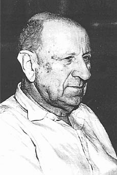

# 柳比歇夫

亚历山大·亚历山德罗维奇·柳比歇夫（Alexander Alexandrovich Lyubishchev 1890年4月5日——1972年8月31日），前苏联的昆虫学家、[哲学家](https://baike.baidu.com/item/%E5%93%B2%E5%AD%A6%E5%AE%B6/3968)、数学家。毕业于圣彼得堡国立大学，一生发布了70余部学术著作，从分散分析、生物分类学到昆虫学等。业余时间研究地蚤的分类，还写过不少科学回忆录。 各种各样的论文和专著，他一共写了五百多印张。五百印张，等于一万二千五百张打字稿。即使以专业作家而论，这也是个庞大的数字。他不顾政治迫害，做了大量工作来反对和批评当时属于苏联生物遗传学主流的李森科主义。还应用数学方法来研究生物分类学。

### 研究成果

柳比歇夫的遗产包括几个部分：有著作，探讨地蚤的分类、科学史、农业、遗传学、植物保护、哲学、[昆虫学](https://baike.baidu.com/item/%E6%98%86%E8%99%AB%E5%AD%A6)、动物学、[进化论](https://baike.baidu.com/item/%E8%BF%9B%E5%8C%96%E8%AE%BA)、无神论。此外，他还写过回忆录，追忆许多科学家，谈到他一生的各个阶段以及彼尔姆大学……他讲课，当大学教研室主任兼研究所一个室的负责人，还常常到各地考察；三十年代他跑遍了俄罗斯的欧洲部分，去过许多集体农庄，实地研究果树害虫、玉米害虫、黄鼠……在所谓的业余时间，作为“休息”，他研究地蚤的分类。单单这一项，工作量就颇为可观：到一九五五年，柳比歇夫已搜集了三十五篇地蚤标本，共一万三千只。其中五千只公地蚤做了器官切片，总计三百种。这些地蚤都要鉴定、测量、做切片、制作标本。他收集的材料比动物研究所多五倍。他对跳甲属的分类，研究了一生。这需要特殊的深入钻研的才能，需要对这种工作有深刻的理解，理解其价值及其说不尽的新颖之处。有人问到著名的组织学家聂佛梅瓦基，他怎么能一生都用来研究蠕虫的构造，他很惊奇：“蠕虫那么长，人生可是那么短！”

### 时间管理法

#### 概述

柳比歇夫时间管理法是苏联昆虫学家柳比歇夫56年如一日对个人时间进行定量管理而得名的。这种方法建立在数学统计的基础之上，重点是对消耗时间的记录进行分析，使人们能正确认识自己的时间利用状况，并养成管理自己时间的习惯。简单地说，柳比歇夫时间管理法就是要记录时间、分析时间、消除时间浪费、重新安排自己的时间。是个人时间定量管理的方法。

#### 要点

⑴保持时间记录的真实性、准确性。真实是指工作现场的记录，而不是补记的。准确是要求记录的误差不大于15分钟，否则记录就无使用价值；⑵切勿相信凭记忆的估计，人对时间这种抽象物质的记忆是十分不可靠的；⑶选择的时间记录区段要有代表性；⑷及时调整时间分配计划。在检查时间记录时，要找出上一时段计划时间与实耗时间的差，并以此为根据，对下一时段的时间耗用予以重新分配；⑸坚持就是成功。

#### 步骤

⑴**记录。**运用各种各样的耗时记录卡准确地记录时间耗费情况。工作记实表，真实准确；⑵**统计。**每填完一个时间区段后，对时间耗费情况进行分类统计，看看用于开会、听汇报、检查工作、调查研究、走访用户、读书看报等项目的时间比例有多大，并绘成图表。⑶**分析。**对照工作效果，分析时间耗费的情况，找出浪费时间的因素。浪费时间的因素主要表现在：做了不该做的工作；做了应该由别人做的工作；做了浪费别人时间的工作；犯了过去犯过的错误；开会和处理人事关系时间过长等等。⑷**反馈。**根据分析结果制订消除浪费时间因素的计划，并反馈于下一时段。**那么这种时间事件记录法具体是怎样来记录的呢？下面是柳比歇夫的记录文字：**乌里扬诺夫斯克。一九六四年四月七日。分类昆虫学（画两张无名袋蛾的图）–三小时十五分。鉴定袋蛾–二十分（1.0）附加工作：给斯拉瓦写信–二小时四十五分（0.5）。社会工作：植物保护小组开会–二小时二十五分。休息：给伊戈尔写信–十分；《乌里扬诺夫斯克真理报》 –十分；列夫·托尔斯泰的《塞瓦斯托波尔纪事》–一小 时二十五分。**基本工作合计**–六小时二十分。乌里扬诺夫斯克。一九六四年四月八日。分类昆虫学：鉴 定袋蛾，结束–二小时二十分。开始写关于袋蛾的报告–一小时五分（1.0）。附加工作：给达维陀娃和布里亚赫尔写信，六页–三小时 二十分（0.5）。路途往返–0.5。休息–剃胡子。《乌里扬诺夫斯克真理报》–十五分， 《消息报》–十分，《文学报》–二十分；阿·托尔斯泰的《吸 血鬼》，六十六页–一小时三十分。听里姆斯基-柯萨科夫的 《沙皇的未婚妻》 。**基本工作合计**–六小时四十五分。”我把自己的时间事件记录和柳比歇夫的记录对比之后发现，柳比歇夫对日常的各种事情做了分类，比如，基本科研、分类昆虫学等等。这样做的好处就是方便最终统计在各项活动上你到底花了多少时间。比如下面的柳比歇夫的统计结果：基本科研 – 五十九小时四十五分分类昆虫学 – 二十小时五十五分附加工作 – 五十小时二十五分组织工作 – 五小时四十分**合计**一 百三十六小时四十五分“基本科研”这五十九小时四十五分包括什么内容？用在什么上了？分类工作 – 《分类法的逻辑》报告草稿 –六小时二十五分杂事 – 一小时零分校对《达达派研究》 – 三十分数学– 十六小时四十分日常参考书：里亚普诺夫 – 五十五分日常参考书：生物学 – 十二小时零分学术通信 – 十一小时五十五分学术札记 – 三小时二十五分图书索引 – 六小时五十五分**合计**– 五十九小时四十五分”我们还可以随便拿哪一项继续分析下去，就拿第六项吧–日常参考书：生物学–十二小时。这十二小时花在什么上面，一目了然，误差不超过一分钟。陀布尔让斯基《人类的进化》，三百七十二页，看完（共十六小时五十五分） – 六小时四十五分亚诺什·卡罗埃《动物有没有思想》， 九十一页 – 二小时零分P．贝尔格的手稿 – 二小时零分聂考洛，奥斯维尔陀，十七页 – 四十分拉特纳的手稿 – 一小时三十分**合计**– 十二小时五十五分”通过做这样的记录，柳比歇夫获得了精确感知时间的能力。

### 参考资料

1. [百度百科 柳比歇夫](https://baike.baidu.com/item/%E6%9F%B3%E6%AF%94%E6%AD%87%E5%A4%AB)
2. [怎样评价柳比歇夫的时间统计法？](https://www.zhihu.com/question/37195613)
3. APP：aTimeLogger

